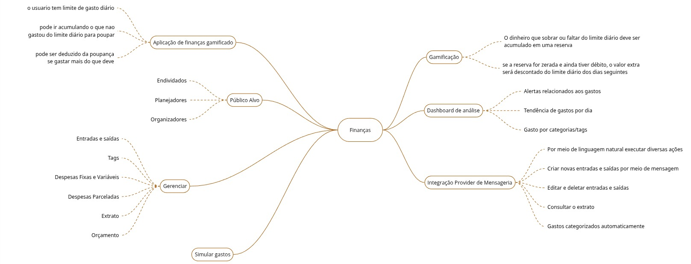

# 1.2. Módulo Artefato Generalista

Os artefatos generalistas auxiliam na compreensão do problema e na definição de soluções, independentemente da metodologia adotada. Nesse processo, a equipe gerou 3 artefatos generalistas:

### Rich Pictures

Trata-se de uma forma de modelagem de ideias, pouco formal, e ideal para reuniões com clientes e/ou em times de desenvolvimento. Este artefato foi selecionado pois pode ser utilizado no inicio do processo de elicitação e não necessita de um grande conhecimento prévio para ser utilizado, nem uma orientação metodológica especifica para sua criação. Nesse artefato tem um foco principal, onde a partir dele é possível entender o contexto do problema, as pessoas envolvidas, as relações entre elas e os problemas que elas enfrentam.

 

### 5W2H

É um recurso de gestão que auxilia na definição de um plano de ação, respondendo sete perguntas: What (O quê), Why (Por quê), Where (Onde), When (Quando), Who (Quem), How (Como) e How Much (Quanto). Dessa forma, é possível documentar de forma direta, clara e objetiva as principais informações do projeto. Para o Como, foi consultado a documentação oficial da OpenAI [1].

 

### Mapa Mental

Mapa mental é um diagrama que resume de forma gráfica ideias e conceitos, conectando palavras e imagens a um nó central. Como estamos interessados em produzir um artefato que represente as ideias e conceitos gerados, selecionamos essa metodologia para essa etapa do projeto.

 

[1] OPENAI. Plataforma de API. Disponível em: https://openai.com/pt-BR/api/
. Acesso em: 30 mar. 2026.