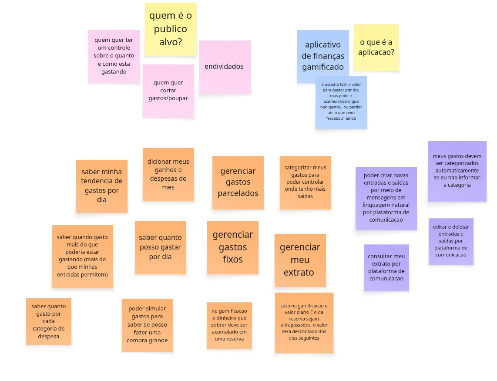
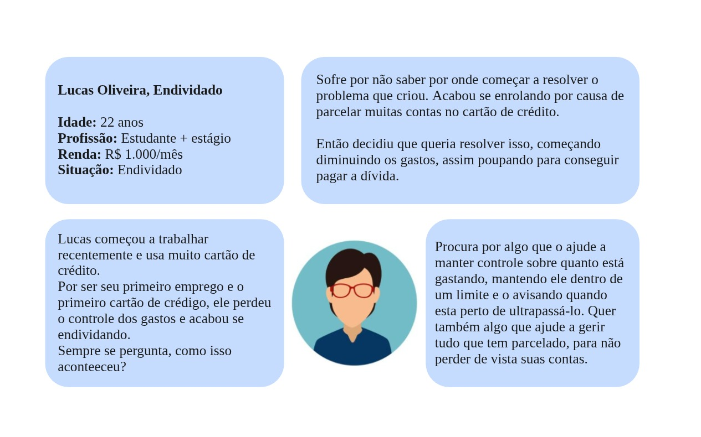
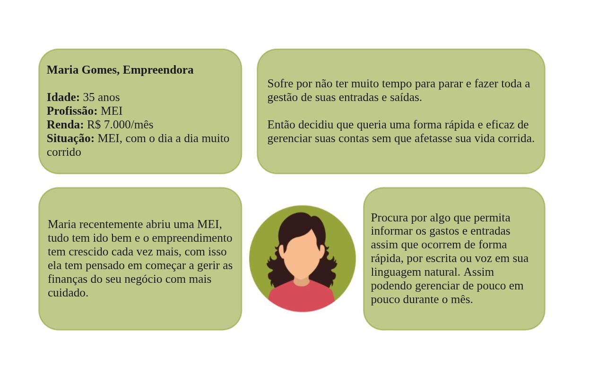
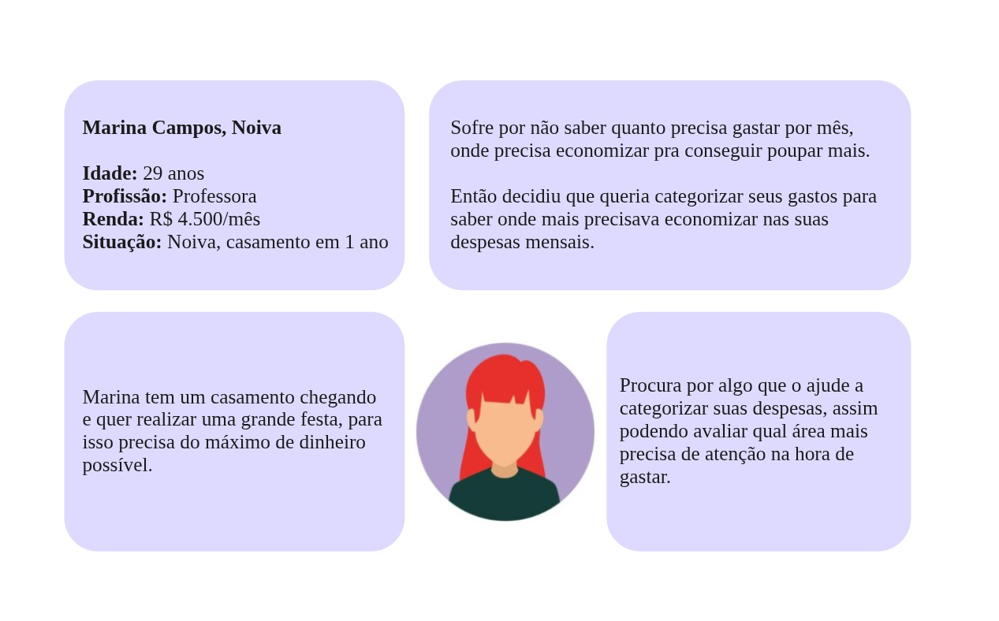
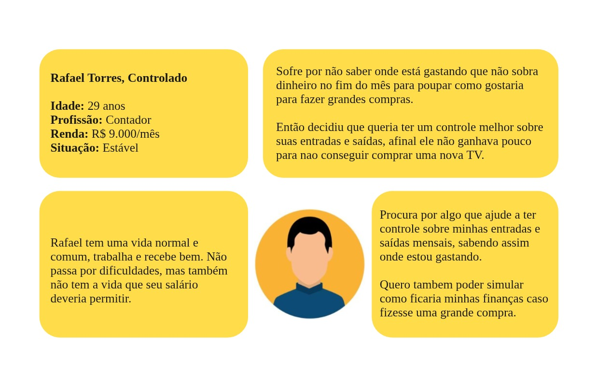

# Unpack 

## Introdução 

A etapa de Unpack é a primeira etapa do Design Sprint, onde o time analisa o problema, define o objetivo e reúne o máximo de contexto sobre o desafio. O objetivo dessa etapa é entender o problema e coletar a maior quantidade de insights para depois serem debatidos.

## Metodologia

As metodologias utilizadas nessa etapa foram o Brainstorm e as Personas para entender melhor o problema e o contexto do projeto.

### Brainstorm

O Brainstorm é uma técnica de geração de ideias que visa coletar o máximo de ideias possíveis em um curto período de tempo. Por esse motivo, foi selecionada essa metodologia para essa etapa do projeto, com o objetivo de obter o máximo de informações e ideias para resolver o problema proposto. 

 

### Personas

Como estamos buscando compreender quem é o usuário, quais são suas dores, necessidades, comportamentos, e contexto de uso, selecionamos a metodologia de personas para essa etapa do projeto. Foram desenvolvidas 4 personas para representar os usuários do projeto:

 

<b>Persona 1:</b> Lucas, Endividado

 

<b>Persona 2:</b> Maria, Empreendedora

 

<b>Persona 3:</b> Marina, Noiva

 

<b>Persona 4:</b> Rafael, Controlado

## Conclusão

Foram gerados dois artefatos com o objetivo de entender melhor o problema e o contexto do projeto. O primeiro artefato foi o Brainstorm, que visava coletar o máximo de ideias possíveis em um curto período de tempo. O segundo artefato foi o de Personas, que visava compreender quem é o usuário, quais são suas dores, necessidades, comportamentos, e contexto de uso.

## Referências

Miro. Disponível em: https://miro.com/pt/. Acesso em: 23 de out de 2024

Barbosa, S. D. J.; Silva, B. S. da; Silveira, M. S.; Gasparini, I.; Darin, T.; Barbosa, G. D. J. (2021) Interação Humano-Computador e Experiência do usuário. Capítulo 7 Identificação de Necessidades dos Usuários e Definição dos Requisitos de IHC, tópico 7.5.4 Brainstorming de Necessidades e Desejos dos Usuários, página 152. Autopublicação. ISBN: 978-65-00-19677-1.