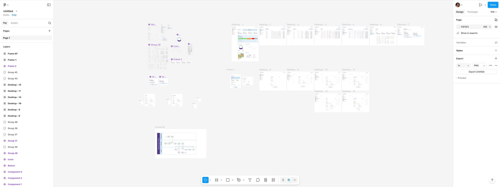
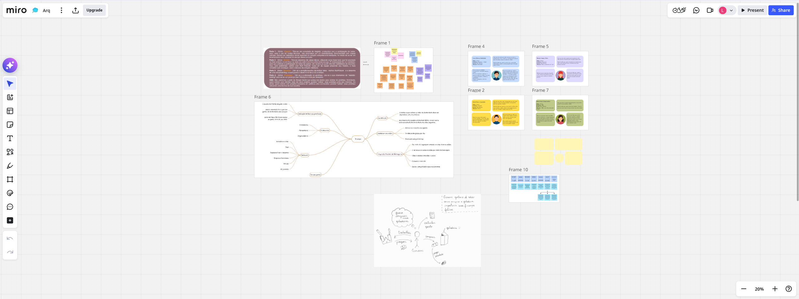

# Finanças

**Código da Disciplina**: FGA0208 
**Número do Grupo**: G8 
**Entrega**: 01 

## Alunos
|Matrícula | Aluno |
| -- | -- |
| 211031092  |  Larissa Gomes Silva |

## Sobre 
O projeto **Finanças** é uma aplicação web de gestão financeira pessoal que combina controle de movimentações, orçamento diário com sistema de reserva, gamificação e inteligência artificial para registro por linguagem natural.

### Aplicativos e Sites Semelhantes

O mercado brasileiro já conta com diversas soluções de controle financeiro, cada uma com um foco diferente:

| Aplicativo | Foco Principal | Destaque | Link |
| --- | --- | --- | --- |
| **Mobills** | Gestão financeira completa | Integração bancária via Open Finance, planejamento por categorias e metas | [mobills.com.br](https://www.mobills.com.br) |
| **Organizze** | Simplicidade e organização visual | Interface amigável, conexão bancária, foco em facilidade de uso | [organizze.com.br](https://www.organizze.com.br) |
| **Fortune City** | Gamificação | Transforma o registro de gastos em um jogo de construção de cidades | [fortunecityapp.com](https://fortunecityapp.com) |
| **YNAB** | Orçamento baseado em regras | Método "Give Every Dollar a Job", métrica "Age of Money" como gamificação sutil | [ynab.com](https://www.ynab.com) |
| **Cleo** | IA conversacional | Chatbot com personalidade que analisa gastos e dá conselhos com humor | [meetcleo.com](https://www.meetcleo.com) |
| **Minhas Economias** | Gratuito e abrangente | 100% gratuito, com gerenciador de sonhos e gráficos | [minhaseconomias.com.br](https://www.minhaseconomias.com.br) |

### Diferenciais do Projeto

O projeto **Finanças** se diferencia por combinar, em uma única plataforma, três itens que normalmente são encontrados de forma isolada:

1. **Orçamento diário com reserva automática**: Diferente de apps que focam apenas no orçamento mensal, o sistema calcula um limite diário de gastos e acumula o que não foi gasto em uma reserva, promovendo disciplina financeira no dia a dia. Esse conceito é inspirado em planilhas de controle como a da **BTG Pactual** [3].

2. **Gamificação financeira**: Sequência de dias dentro do limite (*streak*), calendário visual de progresso e sistema de alertas graduais. Estudos e produtos como **Fortune City** e **Bread Budgeting** [4] demonstram que a gamificação aumenta o engajamento e transforma o controle financeiro em hábito.

3. **IA por linguagem natural**: Registro de movimentações via mensagens em linguagem natural utilizando a **API da OpenAI** [5]. A tendência de **IA agêntica** em finanças pessoais — onde o assistente não apenas aconselha, mas executa ações — é apontada como a grande evolução do setor para 2026 [6][7].

### Referências

[1] SERASA. Mapa da Inadimplência e Negociação de Dívidas no Brasil. Disponível em: https://www.serasa.com.br/limpa-nome-online/blog/mapa-da-inadimplencia-e-renogociacao-de-dividas-no-brasil. Acesso em: 30 mar. 2026.

[2] CNC - Confederação Nacional do Comércio de Bens, Serviços e Turismo. Pesquisa depilares Endividamento e Inadimplência do Consumidor (PEIC). Disponível em: https://www.portaldocomercio.org.br/publicacoes/pesquisa-de-endividamento-e-inadimplencia-do-consumidor-peic-fevereiro-de-2025/. Acesso em: 30 mar. 2026.

[3] BTG PACTUAL. Planilha de gastos. Disponível em: https://cloud.btgpactual.com/planilha-manu-cit. Acesso em: 30 mar. 2026.

[4] SMARTICO. Gamification in Finance: How It Works. Disponível em: https://smartico.ai/gamification-in-finance/. Acesso em: 30 mar. 2026.

[5] OPENAI. Plataforma de API. Disponível em: https://openai.com/pt-BR/api/. Acesso em: 30 mar. 2026.

[6] ORGANIZZE. Inteligência artificial e finanças pessoais. Disponível em: https://www.organizze.com.br/blog/inteligencia-artificial-financas-pessoais. Acesso em: 30 mar. 2026.

[7] ECONOMIC NEWS BRASIL. IA em finanças pessoais: tendências 2026. Disponível em: https://economicnewsbrasil.com.br. Acesso em: 30 mar. 2026.

## Screenshots da Primeira Entrega

 

<b>Imagem 1:</b> Miro Board

 

<b>Imagem 2:</b> Figma Board

## Há algo a ser executado?

( ) SIM

( ) NÃO

Se SIM, insira um manual (ou um script) para auxiliar ainda mais os interessados na execução.

## Informações Complementares 
Quaisquer outras informações adicionais podem ser descritas nessa seção.
